# 목차
- [ApplicationContext](#applicationcontext)
- [Spring Container 생성 과정](#spring-container-생성-과정)
- [Spring Container에 등록된 모든 Bean 조회](#spring-container에-등록된-모든-bean-조회)
- [Spring Container 와 Singleton Bean](#spring-container-와-singleton-bean)
- [@ComponentScan 과 의존관계 자동 주입](#componentscan-과-의존관계-자동-주입)
- [@Autowired 시, 동일한 타입의 Bean이 2개 이상인 경우](#autowired-시-동일한-타입의-bean이-2개-이상인-경우)
- [Bean 자동 등록 (@Component) vs 수동 등록 (@Bean)](#bean-자동-등록-component-vs-수동-등록-bean)
- [Spring Bean 생명주기와 콜백](#spring-bean-생명주기와-콜백)
- [Bean Scope](#bean-scope)
- [Web Scope](#web-scope)
- [Reference](#reference)

---
# ApplicationContext
- Spring Container 인터페이스
- 구현체 예시 목록
  - `AnnotaionConfigApplicationContext`
  - `GenericXmlApplicationContext`
  - `GenericGroovyApplicationContext`
  - `StaticApplicationContext`
- ISP (Interface Segregation Principle)
  - `BeanFactory`
    - Bean을 관리하고 조회하는 역할
    - `ListableBeanFactory`
    - `HierarchicalBeanFactory`
  - `EnvironmentCapable`
    - 로컬, 개발, 운영 등을 구분해서 환경변수를 관리하는 역할
  - `ResourceLoader`
    - 파일, classpath, 외부 등에서 Resource를 관리하고 조회하는 역할
    - `ResourcePatternResolver`
  - `MessageSource`
    - 메시지를 다국어로 처리하는 기능을 담당하는 역할
  - `ApplicationEventPublisher`
    - 이벤트를 발행하고 구독하는 모델을 편리하게 지원하는 역할

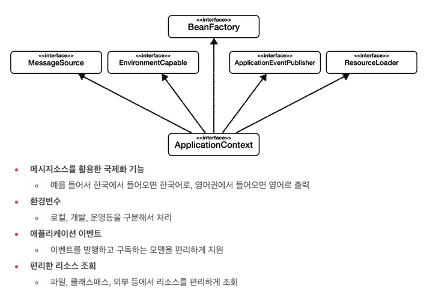

```java
public interface ApplicationContext extends EnvironmentCapable, ListableBeanFactory, HierarchicalBeanFactory,
		MessageSource, ApplicationEventPublisher, ResourcePatternResolver {
        // ...
}
```

## ApplicationContext 클래스 다이어그램
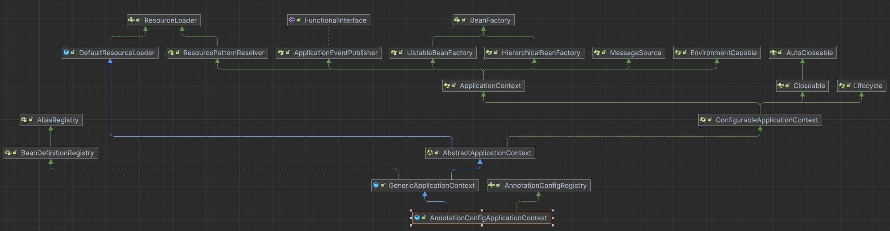

## 다양항 설정 형식 지원
- Annotation
- XML
- ...

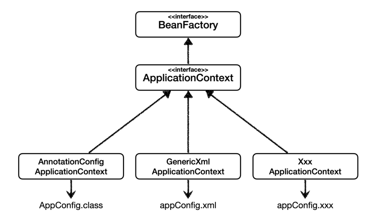

# Spring Container 생성 과정
> 1. Spring Bean을 생성한다.
> 2. Spring Bean들의 의존관계를 주입한다.

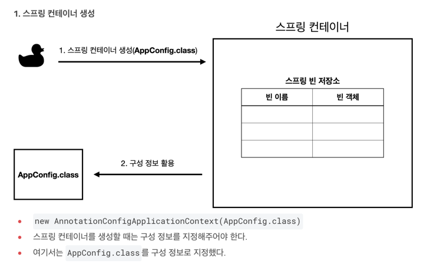

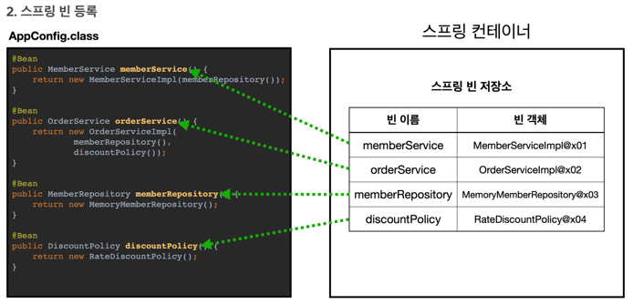

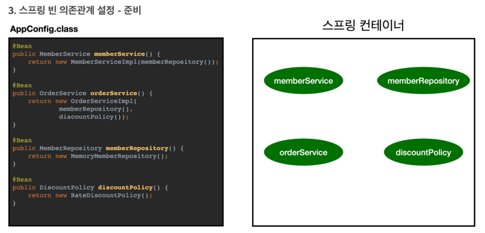

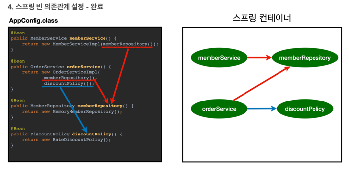


# Spring Container에 등록된 모든 Bean 조회
- `ApplicationContext::getBeanDefinitionNames()` : 등록된 모든 Bean 이름 조회
- [코드 예시](https://github.com/rolroralra/spring-basic/blob/master/src/test/java/com/example/core/beanfind/ApplicationContextInfoTests.java)

```java
class ApplicationContextTests {
  @Test
  @DisplayName("Application Bean 출력하기")
  void findApplicationBean() {
    String[] beanDefinitionNames = applicationContext.getBeanDefinitionNames();

    for (String beanDefinitionName : beanDefinitionNames) {
      BeanDefinition beanDefinition
              = applicationContext.getBeanDefinition(beanDefinitionName);

      if (beanDefinition.getRole() == BeanDefinition.ROLE_APPLICATION) {
        Object bean = applicationContext.getBean(beanDefinitionName);
        System.out.println("name = " + beanDefinitionName + ", bean = " + bean);
        System.out.println("beanDefinition = " + beanDefinition);
      }
    }
  }
}
```

## Spring Bean 조회 

### Bean 이름으로 조회
- `ApplicationContext::getBean(beanName)`
- 해당 이름으로 등록된 Bean이 없는 경우
  - `NoSuchBeanDefinitionException` 예외 발생
- [코드 예시](https://github.com/rolroralra/spring-basic/blob/master/src/test/java/com/example/core/beanfind/ApplicationContextBeanFindTests.java)

### Bean 이름, Bean 타입으로 조회
- `ApplicationContext::getBean(beanName, beanType)`
- [코드 예시](https://github.com/rolroralra/spring-basic/blob/master/src/test/java/com/example/core/beanfind/ApplicationContextBeanFindTests.java)

### Bean 타입으로 조회
- `ApplicationContext::getBean(beanType)`
  - 같은 타입의 Bean이 2개 이상 등록된 경우
    - `NoUniqueBeanDefinitionException` 예외 발생
- [코드 예시](https://github.com/rolroralra/spring-basic/blob/master/src/test/java/com/example/core/beanfind/ApplicationContextBeanFindTests.java)

### 동일한 타입 둘 이상의 Bean 조회
- `ApplicationContext::getBeansOfType(beanType)` : `Map<String, T>`
- [코드 예시](https://github.com/rolroralra/spring-basic/blob/master/src/test/java/com/example/core/beanfind/ApplicationContextNoUniqueBeanFindTests.java)

### Spring Bean 조회 - 상속관계
- 부모 타입으로 조회하면, 자식 타입도 함께 조회한다.
- [코드 예시](https://github.com/rolroralra/spring-basic/blob/master/src/test/java/com/example/core/beanfind/ApplicationContextExtendsBeanFindTests.java)

## BeanDefinition
- Bean의 메타데이터 정보를 담고 있는 인터페이스

### BeanClassName
- BeanClassName : `String`
  - 생성할 Bean의 클래스 명
  
### Bean Scope
- Scope : `int`
  - 기본값: `SCOPE_SINGLETON`
  - `SCOPE_SINGLETON`
  - `SCOPE_PROTOTYPE`

### Lazy Initialization
- LazyInit : `boolean`

### DependsOn
- DependsOn : `String[]`
  - 해당 Bean이 생성되기 전에 먼저 생성되어야 하는 Bean의 이름

### Autowire Candidate
- AutowireCandidate : `boolean`
  - 해당 Bean을 다른 Bean의 의존성 주입 후보로 사용할지 여부

### Primary
- Primary : `boolean`
- 같은 타입의 Bean이 여러 개 등록된 경우, 우선권을 가지는 Bean을 설정
- `@Autowired` 어노테이션을 사용할 때 우선권을 가지는 Bean을 주입한다.

### Factory Bean Name, Factory Method Name
- FactoryBeanName : `String`
  - 해당 Bean을 생성하는 Factory Bean의 이름
  - ex: `@Configuration` 어노테이션을 가진 Bean의 이름
- FactoryMethodName : `String`
  - 해당 Bean을 생성하는 Factory Method의 이름

### Constructor Argument Values, Property Values
- ConstructorArgumentValues : `ConstructorArgumentValues`
  - 생성자를 통해 Bean을 생성할 때 사용할 인자 정보
- PropertyValues : `MutablePropertyValues`

### Init Method Name, Destroy Method Name
- InitMethodName : `String`
  - Bean 생성 후 호출할 초기화 메서드 이름
- DestroyMethodName : `String`
  - Bean 소멸 전 호출할 메서드 이름

### Role 
- Role : `int`
  - `ROLE_APPLICATION` : 일반적으로 사용자가 정의한 Bean
  - `ROLE_INFRASTRUCTURE` : 스프링 내부에서 사용하는 Bean
  - `ROLE_SUPPORT`

# Spring Container 와 Singleton Bean
- Spring Container는 기본적으로 모든 Bean을 Singleton으로 관리한다.
- Bean Scope 설정에 따라 다른 Lifecycle을 가진 Bean을 생성할 수 있다.
  - `SCOPE_SINGLETON`
  - `SCOPE_PROTOTYPE`

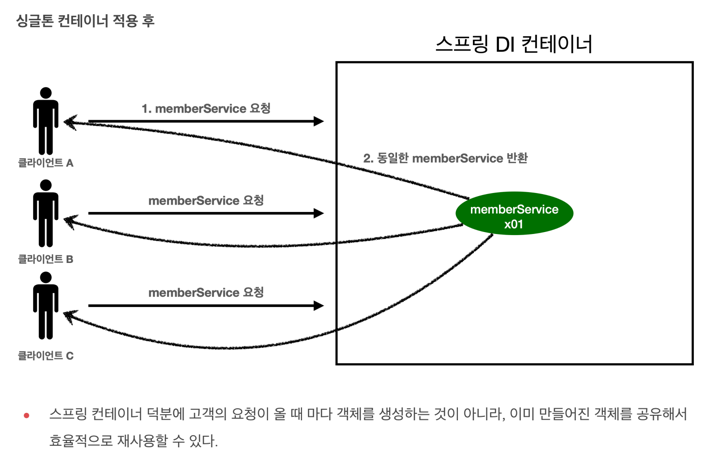

## Singleton 방식의 주의사항 
- Singleton 객체는 stateless 하게 설계해야 한다.
  - 특정 클라이언트에 의존적인 필드가 있으면 안된다.
  - 특정 클라이언트가 값을 변경할 수 있는 필드가 있으면 안된다.
  - 가급적 읽기만 가능해야 한다.
  - 공유되는 필드가 있다면, Thread-safe 하게 설계해야 한다.
    - Local Variable, Method Parameter, ThreadLocal 등을 사용해야 한다.

## @Configuration과 바이트코드 조작
- `@Configuration` 어노테이션을 가진 Bean은 CGLIB 라이브러리를 사용하여 바이트코드를 조작한다.
- 만약 `@Configuration` 어노테이션을 제거한다면, Singleton Bean으로 등록되지 않는다.
  - CGLIB 라이브러리를 통해 바이트코드 조작이 되지 않기 때문이다.

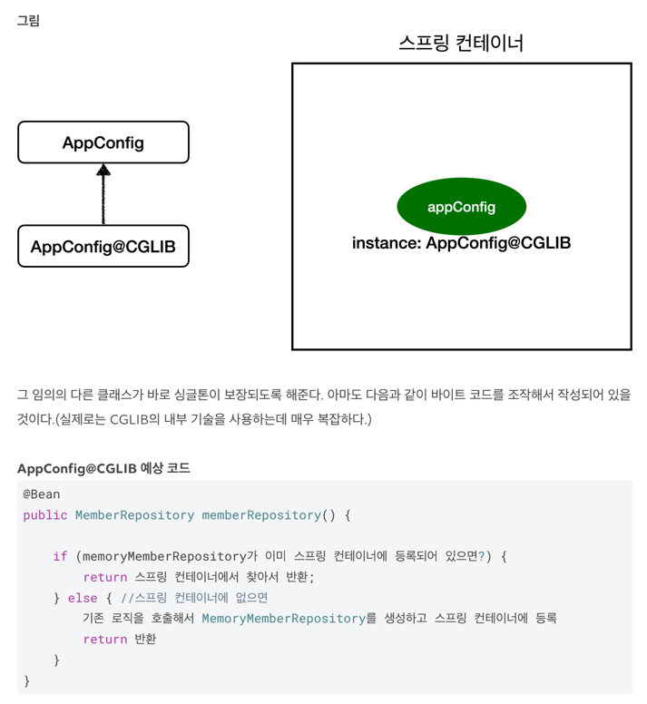

# @ComponentScan 과 의존관계 자동 주입
1. `@ComponentScan` 어노테이션을 사용하면, `@Component` 어노테이션이 붙은 클래스를 찾아서 Bean으로 등록한다.
2. `@Autowired` 어노테이션을 사용하면, 해당 타입의 Bean을 찾아서 의존관계를 자동으로 주입한다.

## @ComponentScan
- `basePackages` : `String[]`
- `basePackageClasses` : `Class<?>[]`
- `includeFilters` : `Filter[]`
- `excludeFilters` : `Filter[]`
- `useDefaultFilters` : `boolean`
  - 기본값: `true`
  - `@Component`, `@Repository`, `@Service`, `@Controller`, `@Configuration` 어노테이션을 스캔 대상으로 설정한다.
- `lazyInit` : `boolean`
  - 기본값: `false`
  - `@Component` 어노테이션을 가진 Bean을 생성할 때, Lazy Initialization을 사용할지 여부
- `nameGenerator` : `BeanNameGenerator`
  - Bean의 이름을 생성하는 방식을 설정한다.
  - 구현체 예시
    - `DefaultBeanNameGenerator`
    - `AnnotationBeanNameGenerator`
    - `FullyQualifiedAnnotationBeanNameGenerator`
  
  ```java
  public interface BeanNameGenerator {
      String generateBeanName(BeanDefinition definition, BeanDefinitionRegistry registry);
  }
  ```
- `scopeResolver` : `ScopeMetadataResolver`
  - Bean의 Scope를 결정하는 방식을 설정한다.
  - 구현체 예시
    - `AnnotationScopeMetadataResolver`
    - `Jsr330ScopeMetadataResolver`
    
  ```java
  public interface ScopeMetadataResolver {
      ScopeMetadata resolveScopeMetadata(BeanDefinition definition);
  }
  ```
- `scopedProxy` : `ScopedProxyMode`
  - 기본값: `ScopedProxyMode.DEFAULT`
  - `ScopedProxyMode.NO`
  - `ScopedProxyMode.INTERFACES` : 인터페이스를 사용하여 JDK dynamic Proxy를 생성한다.
  - `ScopedProxyMode.TARGET_CLASS` : CGLIB 라이브러리를 사용하여 Proxy를 생성한다.
- `lazyInit` : `boolean`
  - 기본값: `false`
  - `@Component` 어노테이션을 가진 Bean을 생성할 때, Lazy Initialization을 사용할지 여부
- `resourcePattern` : `String`
  - 기본값: `**/*.class`
    - `ClassPathScanningCandidateComponentProvider.DEFAULT_RESOURCE_PATTERN`
  - 클래스를 찾을 때 사용할 패턴을 설정한다.

### @ComponentScan 기본 대상
- `@Component`
- `@Controller`
  - Spring MVC 컨트롤러로 인식
- `@Repository`
  - Spring Data 접근 계층으로 인식
  - Data 계층의 예외를 스프링 예외로 변환
- `@Service`
  - 비즈니스 로직을 처리하는 서비스 계층으로 인식
- `@Configuration`
  - 스프링 설정 정보로 인식
  - `@Bean` 어노테이션을 가진 메서드를 호출하여 Singleton Bean으로 등록한다.

### @Filter
- `@ComponentScan(includeFilters = {...})`
  - 컴포넌트 스캔 대상을 추가로 지정한다.
- `@ComponentScan(excludeFilters = {...})`
  - 컴포넌트 스캔에서 제외할 대상을 지정한다.
  
```java
@Retention(RetentionPolicy.RUNTIME)
@Target({})
@interface Filter {

    FilterType type() default FilterType.ANNOTATION;

    @AliasFor("classes")
    Class<?>[] value() default {};

    @AliasFor("value")
    Class<?>[] classes() default {};

    String[] pattern() default {};
}
```

### FilterType
- `ANNOTATION`
  - 특정 Annotation을 가진 클래스를 찾는다.
- `ASSIGNABLE_TYPE`
  - 특정 타입과 그 타입을 상속받은 클래스를 찾는다.
- `ASPECTJ`
  - AspectJ `pattern`을 사용하여 클래스를 찾는다.
- `REGEX`
  - 정규 표현식 `pattern`을 사용하여 클래스를 찾는다.
- `CUSTOM`
  - `TypeFilter` 인터페이스를 구현한 클래스를 사용하여 클래스를 찾는다.

```java
public enum FilterType {
    
	ANNOTATION,
  
	ASSIGNABLE_TYPE,
  
	ASPECTJ,
  
	REGEX,
  
	CUSTOM
}
```

```java
public interface TypeFilter {
	boolean match(MetadataReader metadataReader, MetadataReaderFactory metadataReaderFactory)
			throws IOException;
}
```

## 중복 등록과 충돌
1. 자동 빈 등록 vs 자동 빈 등록
2. 수동 빈 등록 vs 자동 빈 등록

### 자동 빈 등록 vs 자동 빈 등록
- `ConflictingBeanDefinitionException` 예외 발생

### 수동 빈 등록 vs 자동 빈 등록
- 수동 빈 등록이 우선권을 가진다.
- 하지만 최근 SpringBoot에서는 수동 빈 등록과 자동 빈 등록이 충돌하는 경우, 오류를 발생시킨다.
  - `Consider renaming one of the beans or enabling overriding by setting spring.main.allow-bean-definition-overriding=true`
- `spring.main.allow-bean-definition-overriding=true` 설정을 통해 오류를 해결할 수 있다.

---
# 의존관계 자동 주입 (Dependency Injection)
> 의존관계 주입에는 크게 4가지 방법이 있다.

1. 생성자 주입
2. 수정자 주입(setter 주입)
3. 필드 주입
4. 일반 메서드 주입
5. [추가] 옵션 처리

## 1. 생성자 주입
- 생성자를 통해 의존관계를 주입하는 방법
- 생성자 호출 시점에 딱 1번만 호출되는 것이 보장된다.
- 생성자가 딱 1개만 있으면, `@Autowired` 어노테이션을 생략할 수 있다.

```java
@Component
@RequiredArgsConstructor
public class OrderServiceImpl implements OrderService {

    private final MemberRepository memberRepository;
    private final DiscountPolicy discountPolicy;
}
```

### Lombok 라이브러리 적용 방법
```groovy
configurations {
    compileOnly {
        extendsFrom annotationProcessor
    }
}

dependencies {
    compileOnly 'org.projectlombok:lombok'
    annotationProcessor 'org.projectlombok:lombok'
}
```

## 2. 수정자 주입(setter 주입)
- setter 메서드를 통해 의존관계를 주입하는 방법
- `@Autowired(required = false)` 로 설정할 경우
  - 주입할 대상이 없으면, 메서드 자체가 호출되지 않는다.
- **단점**
  - setter 메서드를 공개해야 한다.
  - 개발자가 setter 메서드를 호출할 수 있다.
  - Spring Framework가 없다면, 의존관계 주입이 누락된 것을 알 수 없다.
    - 컴파일 시점에 오류를 확인할 수 없다.

```java
@Component
public class OrderServiceImpl implements OrderService {

    private MemberRepository memberRepository;
    private DiscountPolicy discountPolicy;

    @Autowired
    public void setMemberRepository(MemberRepository memberRepository) {
        this.memberRepository = memberRepository;
    }

    @Autowired
    public void setDiscountPolicy(DiscountPolicy discountPolicy) {
        this.discountPolicy = discountPolicy;
    }
}
```

### 3. 필드 주입
- 필드에 바로 주입하는 방법
- 외부에서 변경이 불가능
- DI를 제공하는 Framework가 없다면, 아무것도 할 수 없다.
  - 테스트 하기 힘들다.
- `@SpringBootTest` 처럼 Spring Container를 기반으로 테스트하는 경우, 사용할 수 있다.

```java
@Component
public class OrderServiceImpl implements OrderService {

    @Autowired
    private MemberRepository memberRepository;

    @Autowired
    private DiscountPolicy discountPolicy;
}
```

### 4. 일반 메서드 주입
- 일반 메서드를 통해 의존관계를 주입하는 방법
- 일반적으로 잘 사용하지 않는다.

```java
@Component
public class OrderServiceImpl implements OrderService {

    private MemberRepository memberRepository;
    private DiscountPolicy discountPolicy;

    @Autowired
    public void init(MemberRepository memberRepository, DiscountPolicy discountPolicy) {
        this.memberRepository = memberRepository;
        this.discountPolicy = discountPolicy;
    }
}
```

### 옵션 처리
1. `@Autowired(required = false)`
    - 주입할 대상이 없으면, 주입 시도 자체를 하지 않는다.
2. `@Nullable` : `org.springframework.lang.Nullable`
    - 주입할 대상이 없으면, `null`이 주입된다.
3. `Optional<T>`
    - 주입할 대상이 없으면, `Optional.empty`가 주입된다.

# @Autowired 시, 동일한 타입의 Bean이 2개 이상인 경우
- `NoUniqueBeanDefinitionException` 예외 발생
- 아래와 같은 방법으로 해결한다.
  - `@Autowired` 필드 명 매칭
  - `@Qualifier` 사용
  - `@Primary` 사용

## @Autowired 필드 명 매칭
1. Type 매칭
2. Type 매칭의 결과가 2개 이상일 경우, 필드 명 혹은 파라미터 명으로 Bean 이름 매칭

```java
@Autowired
private DiscountPolicy rateDiscountPolicy;
```

## @Qualifier 사용
- `@Qualifier` 는 추가적인 구분자를 붙여준다.
  - Bean 이름을 지정하는 것이 아니다!

### @Qualifier 사용 방법
1. Bean 등록 시, `@Qualifier` 어노테이션을 사용하여 추가적인 구분자를 붙여준다.
2. `@Autowired` 어노테이션을 사용할 때, `@Qualifier` 어노테이션을 사용하여 구분자를 지정한다.

```java
@Component
@Qualifier("mainDiscountPolicy")
public class RateDiscountPolicy implements DiscountPolicy {
    // ...
}
```

```java
@Autowired
public OrderServiceImpl(MemberRepository memberRepository, 
                        @Qualifier("mainDiscountPolicy") DiscountPolicy discountPolicy) {
    this.memberRepository = memberRepository;
    this.discountPolicy = discountPolicy;
}
```

## @Primary 사용
- `@Primary` 어노테이션을 사용하여 우선권을 가지는 Bean을 설정한다.

```java
@Component
@Primary
public class RateDiscountPolicy implements DiscountPolicy {
    // ...
}

@Component
public class FixDiscountPolicy implements DiscountPolicy {
    // ...
}
```

### @Qualifier, @Primary 우선순위
> `@Qualifier`가 `@Primary` 보다 우선순위가 높다.

1. `@Qualifier` 끼리 매칭 
2. `@Primary` 매칭
3. Bean 이름 매칭

## 조회한 빈이 모두 필요할 경우 (List, Map)
- `List<T>` : 타입의 모든 Bean을 주입받을 수 있다.
- `Map<String, T>` : 타입의 모든 Bean을 이름을 키로 조회할 수 있다.

```java
@Component
@RequiredArgsConstructor
public class DiscountService {

    private final Map<String, DiscountPolicy> policyMap;

    private final List<DiscountPolicy> policies;

    public int discount(Member member, int price, String discountCode) {
        DiscountPolicy discountPolicy = policyMap.get(discountCode);

        return discountPolicy.discount(member, price);
    }
}
```

# Bean 자동 등록 (@Component) vs 수동 등록 (@Bean)
- **업무 로직** 관련 Bean은 자동 등록을 사용하자!
  - `@Component`, `@Controller`, `@Service`, `@Repository`
- **기술 지원** 관련 Bean은 수동 등록을 사용하자!
  - `@Configuration`, `@Bean`
  - 자동 등록을 사용할 경우, 특정 패키지에 모아두는 것이 좋다.

---
# Spring Bean 생명주기와 콜백 
> Spring Bean은 생성되고, 의존관계 주입이 완료된 후, 초기화 콜백 메서드가 호출된다.
> 
> 그리고, 사용이 끝나면 소멸 전 콜백 메서드가 호출된다.

## Spring Bean Lifecycle
1. Spring Container 생성
2. **객체 생성**
3. **의존관계 주입**
4. 초기화 콜백
5. 사용
6. 소멸전 콜백
7. 객체 소멸
8. Spring Container 종료

## Spring Bean Lifecycle Callback
- 초기화 Callback
  - Bean 객체가 생성되고, Bean의 의존관계가 주입이 완료된 후 호출
- 소멸전 Callback
  - Bean 객체가 소멸되기 직전에 호출
  
### InitializingBean, DisposableBean
- `InitializingBean::afterPropertiesSet()` 메서드를 통해 초기화 콜백을 제공한다.
- `DisposableBean::destroy()` 메서드를 통해 소멸전 콜백을 제공한다.
- 단점
  - **_Spring 전용 인터페이스이므로, Spring Framework에 의존한다._**
  - **외부 라이브러리에 적용할 수 없다.**

```java
public interface InitializingBean {
	void afterPropertiesSet() throws Exception;
}

public interface DisposableBean {
  void destroy() throws Exception;
}
```

<details>
  <summary>코드 예시</summary>
  <p>

```java
@Getter
public class NetworkClient1 implements InitializingBean, DisposableBean {

    @Setter
    private String url;

    public NetworkClient1() {
        System.out.println("생성자 호출, url = " + url);
    }

    /**
     * 서비스 시작시 호출
     */
    public void connect() {
        System.out.println("connect: " + url);
    }
    public void call(String message) {
        System.out.println("call: " + url + ", message = " + message);
    }

    /**
     * 서비스 종료시 호출
     */
    public void disconnect() {
        System.out.println("close: " + url);
    }

    @Override
    public void afterPropertiesSet() throws Exception {
        System.out.println(this.getClass().getSimpleName() + ": init");
        connect();
        call("초기화 연결 메시지");
    }

    @Override
    public void destroy() throws Exception {
        System.out.println(this.getClass().getSimpleName() + ": close");
        disconnect();
    }

}
```

  </p>
</details>

### @Bean(initMethod = "init", destroyMethod = "close")
- `@Bean` 어노테이션을 사용하여 초기화 콜백, 소멸전 콜백 메서드를 지정할 수 있다.
- `destroyMethod` 기본값: `(inferred)`
  - **종료 메서드 이름을 지정하지 않으면, `close`, `shutdown` 메서드를 자동으로 호출한다.**
  - 종료 메서드를 추론해서, 호출할 종료 메서드를 자동으로 선택한다.
  - 추론 기능을 사용하지 않으려면, `destroyMethod = ""` 를 설정한다.
- 장점
  - **_외부 라이브러리에도 적용할 수 있다._**

```java
@Bean(initMethod = "init", destroyMethod = "close")
public NetworkClient2 networkClient() {
    NetworkClient2 networkClient = new NetworkClient2();
    networkClient.setUrl("http://hello-spring.dev");
    return networkClient;
}
```

### @PostConstruct, @PreDestroy
- `@PostConstruct` 
  - 어노테이션을 사용하여 **초기화 콜백 메서드를 지정할 수 있다.**
  - `javax.annotation.PostConstruct`
- `@PreDestroy` 
  - 어노테이션을 사용하여 **소멸전 콜백 메서드를 지정할 수 있다.**
  - `javax.annotation.PreDestroy`
- 장점
  - `JSR-250` Java 표준이다.
  - Spring에서 가장 권장하는 방법
- 단점
  - **_외부 라이브러리에 적용할 수 없다._**

<details>
  <summary>코드 예시</summary>
  <p>

```java
@Getter
public class NetworkClient3 {

    @Setter
    private String url;

    public NetworkClient3() {
        System.out.println("생성자 호출, url = " + url);
    }

    /**
     * 서비스 시작시 호출
     */
    public void connect() {
        System.out.println("connect: " + url);
    }
    public void call(String message) {
        System.out.println("call: " + url + ", message = " + message);
    }

    /**
     * 서비스 종료시 호출
     */
    public void disconnect() {
        System.out.println("close: " + url);
    }

    @PostConstruct
    public void init() {
        System.out.println(this.getClass().getSimpleName() + ": init");
        connect();
        call("초기화 연결 메시지");
    }

    @PreDestroy
    public void close() {
        System.out.println(this.getClass().getSimpleName() + ": close");
        disconnect();
    }
}
```

  </p>
</details>

---
# Bean Scope
> Spring Bean이 존재할 수 있는 범위를 뜻한다.

- Spring은 기본적으로 모든 Bean을 Singleton으로 관리한다.
- Spring은 다음과 같은 Bean Scope를 지원한다.
  - `SCOPE_SINGLETON` : 기본값. `"singleton"`
  - `SCOPE_PROTOTYPE` : `"prototype"`
  - `SCOPE_REQUEST` : Web Request 당 하나의 Bean을 생성한다. `"request"`
  - `SCOPE_SESSION` : Web Session 당 하나의 Bean을 생성한다. `"session"`
  - `SCOPE_APPLICATION` : Web의 ServletContext와 같은 범위로 유지되는 Scope. `"application"`

## Bean Scope 설정 방법
- `@Scope` 어노테이션 설정

```java
@Scope("prototype")
@Component
public class PrototypeBean {
}
```

```java
import java.beans.BeanProperty;

@Scope("prototype")
@Bean
public PrototypeBean prototypeBean() {
    return new PrototypeBean();
}
```

### 참고: @Scope, ScopedProxyMode
```java
@Target({ElementType.TYPE, ElementType.METHOD})
@Retention(RetentionPolicy.RUNTIME)
@Documented
public @interface Scope {

	@AliasFor("scopeName")
	String value() default "";

	/**
	 * @see org.springframework.beans.factory.config.ConfigurableBeanFactory#SCOPE_PROTOTYPE
	 * @see org.springframework.beans.factory.config.ConfigurableBeanFactory#SCOPE_SINGLETON
	 * @see org.springframework.web.context.WebApplicationContext#SCOPE_REQUEST
	 * @see org.springframework.web.context.WebApplicationContext#SCOPE_SESSION
	 */
	@AliasFor("value")
	String scopeName() default "";

	ScopedProxyMode proxyMode() default ScopedProxyMode.DEFAULT;
}
```

```java
public enum ScopedProxyMode {

	DEFAULT,
  
	NO,

	/**
	 * JDK dynamic proxy 
	 */
	INTERFACES,

	/**
	 * Create a class-based proxy (uses CGLIB).
	 */
	TARGET_CLASS
}
```

## Prototype Scope
> Spring Container에 요청할 때 마다 새로운 Bean을 생성한다.
> 
> Spring Container는 Prototype Scope Bean을 생성하고 의존관계를 주입하고 초기화 메서드 실행까지만 관여한다.
> 
> 종료 메서드가 호출되지 않는다.

- Prototype Scope Bean은 Spring Container가 생성하고 의존관계 주입까지만 관여한다. 그 이후는 관리하지 않는다.
  - **Spring Container에 요청할 때마다 새로운 Prototype Scope Bean을 생성하고 의존관계를 주입시켜준다.**
  - **Spring Container는 생성되고 의존관계를 주입시키고 반환해준 Prototype Scope Bean을 관리하지 않는다.**
- Spring Container에서 Bean을 조회할 때, 새로운 Bean을 생성하고 의존관계를 주입하고 초기화 메서드를 수행해서 반환한다.
- 사용자가 직접 Prototype Scope Bean을 관리해야 한다.
- `@PreDestory` 같은 종료 메서드가 호출되지 않는다.


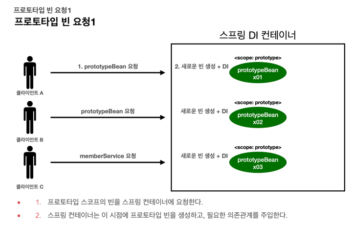
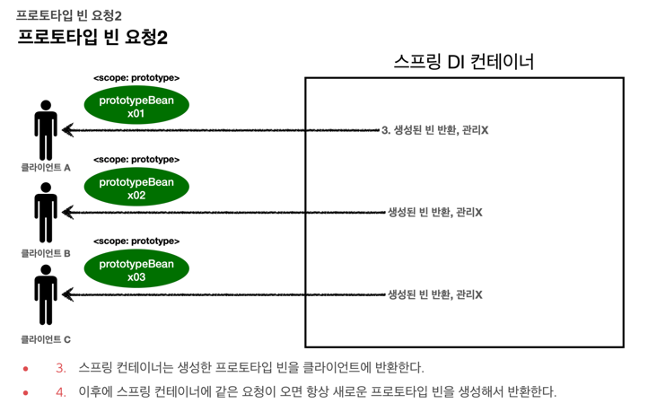

## Singleton Scope Bean과 Prototype Scope Bean 함께 사용시 문제점
- Singleton Scope Bean에서 Prototype Scope Bean을 의존한다고 가정하자.
- **_Prototype Scope Bean을 사용할 때마다 새로 생성되는 것이 아니다!_**
- Singleton Scope Bean이 생성되고 의존관계를 주입할 때, Prototype Scope Bean이 Spring Container에 의해 새로 생성되고 주입된다.

[예시 코드](https://github.com/rolroralra/spring-basic/blob/master/src/test/java/com/example/core/scope/SingletonWithPrototypeTests.java)

### 해결 방법 : Dependency Lookup
1. ApplicationContext
2. ObjectProvider<T>, ObjectFactory<T>
3. JSR-330 Provider<T>

### 1. ApplicationContext
- `ApplicationContext::getBean` 메서드를 사용하여 Prototype Scope Bean을 조회한다.
  - Dependency Lookup(DL)
- 단점
  - Spring Framework에 의존한다.
  - 테스트 코드를 작성하기 어렵다.

#### 코드 예시

<details>
  <summary>코드 예시</summary>
  <p>

```java
@RequiredArgsConstructor
static class SingletonBean {

    private final ApplicationContext applicationContext;

    public int logic() {
        PrototypeBean prototypeBean = applicationContext.getBean(PrototypeBean.class);
        prototypeBean.addCount();
        return prototypeBean.getCount();
    }
}

@Getter
@Scope("prototype")
static class PrototypeBean {

    private int count = 0;

    public void addCount() {
        count++;
    }

    @PostConstruct
    public void init() {
        System.out.println(this.getClass().getSimpleName() + " init... " + this);
    }

    @PreDestroy
    public void destroy() {
        System.out.println(this.getClass().getSimpleName() + " destroy");
    }
}
```

  </p>
</details>

### 2. ObjectProvider<T>, ObjectFactory<T>
- Spring Container에서 Bean을 찾아주는 대신 Dependency Lookup 서비스를 제공하는 인터페이스
- `ObjectProvider<T>` : `ObjectFactory<T>`를 상속하고 편리한 기능들을 추가 제공한다.
- Spring Framework에 의존하긴 하지만, 그나마 mocking 하기 쉽다.
- 단점
  - 여전히 Spring Framework에 의존한다.

```java
@FunctionalInterface
public interface ObjectFactory<T> {
	T getObject() throws BeansException;
}
```

```java
public interface ObjectProvider<T> extends ObjectFactory<T>, Iterable<T> {
  
  T getObject(Object... args) throws BeansException;

  @Nullable
  T getIfAvailable() throws BeansException;

  default T getIfAvailable(Supplier<T> defaultSupplier) throws BeansException {
    T dependency = getIfAvailable();
    return (dependency != null ? dependency : defaultSupplier.get());
  }

  default void ifAvailable(Consumer<T> dependencyConsumer) throws BeansException {
    T dependency = getIfAvailable();
    if (dependency != null) {
      dependencyConsumer.accept(dependency);
    }
  }

  @Nullable
  T getIfUnique() throws BeansException;

  default T getIfUnique(Supplier<T> defaultSupplier) throws BeansException {
    T dependency = getIfUnique();
    return (dependency != null ? dependency : defaultSupplier.get());
  }

  default void ifUnique(Consumer<T> dependencyConsumer) throws BeansException {
    T dependency = getIfUnique();
    if (dependency != null) {
      dependencyConsumer.accept(dependency);
    }
  }

  @Override
  default Iterator<T> iterator() {
    return stream().iterator();
  }

  default Stream<T> stream() {
    throw new UnsupportedOperationException("Multi element access not supported");
  }

  default Stream<T> orderedStream() {
    throw new UnsupportedOperationException("Ordered element access not supported");
  }
}
```

#### 코드 예시
<details>
  <summary>코드 예시</summary>
  <p>

```java
@RequiredArgsConstructor
static class SingletonBean {

  private final ObjectProvider<PrototypeBean> objectProvider;

  public int logic() {
    PrototypeBean prototypeBean = objectProvider.getObject();
    prototypeBean.addCount();
    return prototypeBean.getCount();
  }
}

@Scope("prototype")
static class PrototypeBean {

  @Getter
  private int count = 0;

  public void addCount() {
    count++;
  }

  @PostConstruct
  public void init() {
    System.out.println(this.getClass().getSimpleName() + " init... " + this);
  }

  @PreDestroy
  public void destroy() {
    System.out.println(this.getClass().getSimpleName() + " destroy");
  }
}
```

  </p>
</details>

### 3. JSR-330 Provider<T>
- JSR-330 자바 표준을 사용하는 방법
- `javax.inject:javax.inject:1` 라이브러리를 추가해야 한다.

```java
public interface Provider<T> {
    T get();
}
```

#### 코드 예시
<details>
  <summary>코드 예시</summary>
  <p>

```java
@RequiredArgsConstructor
static class SingletonBean {

  private final Provider<PrototypeBean> provider;

  public int logic() {
    PrototypeBean prototypeBean = provider.get();
    prototypeBean.addCount();
    return prototypeBean.getCount();
  }
}

@Getter
@Scope("prototype")
static class PrototypeBean {

  private int count = 0;

  public void addCount() {
    count++;
  }

  @PostConstruct
  public void init() {
    System.out.println(this.getClass().getSimpleName() + " init... " + this);
  }

  @PreDestroy
  public void destroy() {
    System.out.println(this.getClass().getSimpleName() + " destroy");
  }
}
```

  </p>
</details>

## @Lookup  
- Spring이 제공하는 `@Lookup`을 활용하여 Dependency Lookup 서비스를 사용할 수 있다.
- [@Lookup Annotation in Spring](https://www.baeldung.com/spring-lookup)

### @Lookup 예시 코드 1
```java
@RequiredArgsConstructor
class SingletonBean {
    @Lookup
    public PrototypeBean getPrototypeBean() {
        return null;
    }
}
```

### @Lookup 예시 코드 2
- 내부 구현과는 상관없이, CGLIB를 통해 proxy 객체를 생성하여, `getPrototypeBean()` 메서드를 오버라이딩한다.

```java
@RequiredArgsConstructor
class SingletonBean {
    @Lookup
    public PrototypeBean getPrototypeBean() {
        return new PrototypeBean();
    }
}
```

### @Lookup 예시 코드 3
- SpringFramework에서 자동으로 CGLIB를 통해 byte code를 조작하여, `getPrototypeBean()` 메서드를 오버라이딩한다.
  - CGLIB를 통해 proxy 객체를 생성한다.
```java
@RequiredArgsConstructor
abstract class SingletonBean {
    @Lookup
    public abstract PrototypeBean getPrototypeBean();
}
```

# Web Scope
- Web Scope는 Web 환경에서만 동작한다.
- Web Scope는 Prototype과는 다르게 Spring이 해당 Scope의 종료시점까지 관리한다.
  - `@PreDestroy` 같은 종료 메서드가 호출된다.

## Web Scope 종류
- `request` : HTTP 요청 하나가 들어오고 나갈 때 까지 유지되는 Scope, 각각의 HTTP 요청마다 별도의 Bean 인스턴스가 생성되고, 관리된다.
- `session` : HTTP Session과 동일한 생명주기를 가지는 Scope
- `application` : ServletContext와 동일한 생명주기를 가지는 Scope
- `webSocket` : Web Socket과 동일한 생명주기를 가지는 Scope

### Request Scope
- HTTP 요청이 들어오기 전까지는 Bean을 생성하지 않는다.
- Prototype Scope와 유사하게, Dependency Lookup을 통해 사용해야 한다.
  - `ApplicationContext::getBean`
  - `ObjectFactory<T>`, `ObjectProvider<T>`
  - JSR-330 `Provider`
  - `@Lookup` 어노테이션

<details>
  <summary>코드 예시</summary>
  <p>

```java
@Component
@Scope("request")
@Slf4j
public class MyLogger {

    private String uuid;

    @Setter
    private String requestURL;

    @PostConstruct
    public void init() {
        uuid = java.util.UUID.randomUUID().toString();
        log.info("[{}] request scope bean create: {}", uuid, this);
    }

    @PreDestroy
    public void close() {
        log.info("[{}] request scope bean close: {}", uuid, this);
    }

    public void log(String message) {
        log.info("[{}][{}] {}", uuid, requestURL, message);
    }
}

@Service
@RequiredArgsConstructor
public class LogDemoService {
  private final ObjectProvider<MyLogger> myLoggerProvider;

  public void logic(String id) {
    MyLogger myLogger = myLoggerProvider.getObject();

    myLogger.log("service id = " + id);
  }
}
```

  </p>
</details>

### Request Scope와 Proxy
- proxyMode를 설정하여, HTTP 요청이 들어오는 것과 상관없이 가짜 Proxy 클래스를 만들어서 주입할 수 있다.
  - ObjectProvider를 사용하지 않아도 된다.
- 적용 대상이 인터페이스가 아닌 클래스인 경우 
  - `proxyMode = ScopedProxyMode.TARGET_CLASS` 옵션을 사용한다.
  - CGLIB를 사용하여, 가짜 Proxy 클래스를 만들어서 주입한다.
- 적용 대상이 인터페이스인 경우
  - `proxyMode = ScopedProxyMode.INTERFACES` 옵션을 사용한다.
  - JDK Dynamic Proxy를 사용하여, 가짜 Proxy 클래스를 만들어서 주입한다.

```java
@Component
@Scope(value = "request", proxyMode = ScopedProxyMode.TARGET_CLASS)
public class MyLogger {
    // ...
}
```

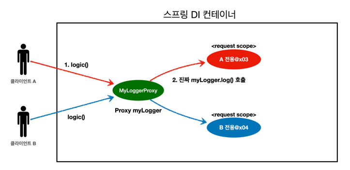

<details>
  <summary>코드 예시</summary>
  <p>

```java
@Component
@Scope(value = "request", proxyMode = ScopedProxyMode.TARGET_CLASS)
@Slf4j
public class MyLogger {
    // ...
}

@Service
@RequiredArgsConstructor
public class LogDemoService {
  private final MyLogger myLogger;

  public void logic(String id) {
    myLogger.log("service id = " + id);
  }
}
```

  </p>
</details>

---
# Reference
[스프링-핵심-원리-기본편 (인프런)](https://www.inflearn.com/course/%EC%8A%A4%ED%94%84%EB%A7%81-%ED%95%B5%EC%8B%AC-%EC%9B%90%EB%A6%AC-%EA%B8%B0%EB%B3%B8%ED%8E%B8)
